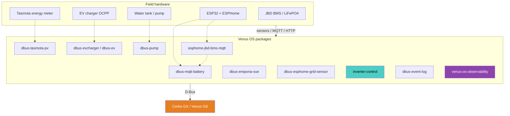
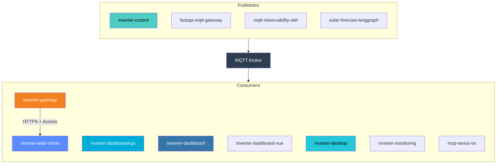
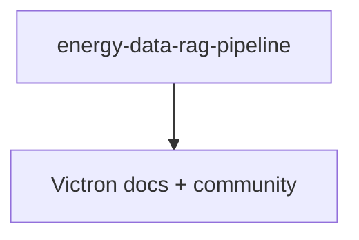

# System architecture (detailed)

Org-level map of how [victron-venus](https://github.com/victron-venus) repos connect around Cerbo GX / Venus OS.

Skim version: [organization profile README](../profile/README.md#system-architecture).

GitHub Mermaid scales **each** diagram to page width. One wide graph stays short and tiny — so this page uses several **narrow, top→bottom** diagrams instead.

## 1. Plant → Venus OS (on Cerbo)

Protocols in short: ESP/BMS → MQTT → `dbus-mqtt-battery`; Tasmota HTTP → `dbus-tasmota-pv`; EV/pump MQTT → `dbus-evcharger` / `dbus-pump`; packages expose D-Bus on Cerbo; `inverter-control` / `dbus-event-log` / `venus-os-observability` attach on D-Bus too.

## 2. MQTT → dashboards & edge

## 3. Data & docs (optional)

## Development & ops

No edges into the live energy path (table on purpose — a disconnected Mermaid subgraph blows out layout):

| Repo | Role |
|------|------|
| [integration-tests](https://github.com/victron-venus/integration-tests) | Cross-repo integration tests |
| [terraform-github-victron](https://github.com/4alvit/terraform-github-victron) | Org GitHub Terraform |
| [terraform-github-4alvit](https://github.com/4alvit/terraform-github-4alvit) | Personal GitHub Terraform |
| [iot-project-builder-profile](https://github.com/4alvit/iot-project-builder-profile) | Public IoT profile site |
| [venus-os-ci-toolkit](https://github.com/victron-venus/venus-os-ci-toolkit) | Shared CI workflows |

## How to read it

| Layer | What lives here |
|-------|-----------------|
| Hardware | Physical plant + Cerbo |
| Control | Venus OS packages on the GX (D-Bus) |
| Bridge | Off-Cerbo MQTT / BMS helpers |
| Monitoring & dashboards | MQTT consumers, gateway, UIs |
| Data & analytics | Forecast / RAG (optional) |
| Development & ops | CI, Terraform, org tooling |

Install path: [INSTALL.md](./INSTALL.md).
