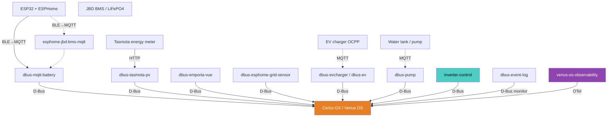
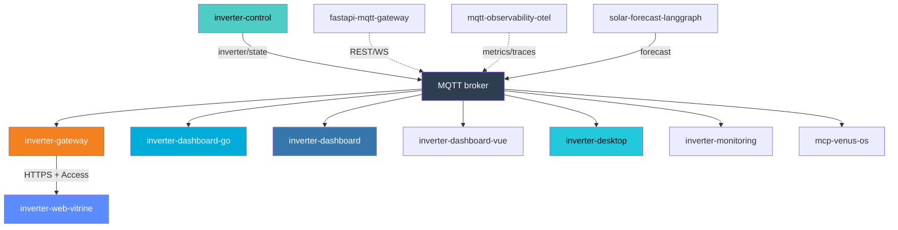
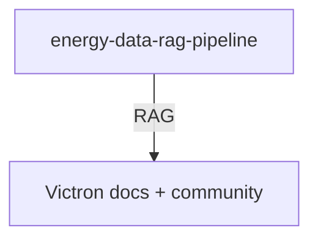

# System architecture (detailed)

Org-level map of how [victron-venus](https://github.com/victron-venus) repos connect around Cerbo GX / Venus OS.

Skim version: [organization profile README](../profile/README.md#system-architecture).

GitHub Mermaid scales each diagram to page width — one giant graph becomes unreadably wide and short. Below, the stack is split into **narrow vertical** diagrams (top → bottom) so labels stay large.

## 1. Plant → Venus OS (on Cerbo)

Field devices and Venus packages meet on the Cerbo over D-Bus / MQTT.

## 2. MQTT → dashboards & edge

Cerbo / control publish into MQTT; UIs and the public edge consume it.

## 3. Data & docs (optional)

## Development & ops

No edges into the live energy path (listed so they do not distort layout):

| Repo | Role |
|------|------|
| [integration-tests](https://github.com/victron-venus/integration-tests) | Cross-repo integration tests |
| [terraform-github-victron](https://github.com/4alvit/terraform-github-victron) | Org GitHub Terraform |
| [terraform-github-4alvit](https://github.com/4alvit/terraform-github-4alvit) | Personal GitHub Terraform |
| [iot-project-builder-profile](https://github.com/4alvit/iot-project-builder-profile) | Public IoT profile site |
| [venus-os-ci-toolkit](https://github.com/victron-venus/venus-os-ci-toolkit) | Shared CI workflows |

## How to read it

| Layer | What lives here |
|-------|-----------------|
| Hardware | Physical plant + Cerbo |
| Control | Venus OS packages on the GX (D-Bus) |
| Bridge | Off-Cerbo MQTT / BMS helpers |
| Monitoring & dashboards | MQTT consumers, gateway, UIs |
| Data & analytics | Forecast / RAG (optional) |
| Development & ops | CI, Terraform, org tooling |

Install path: [INSTALL.md](./INSTALL.md).
