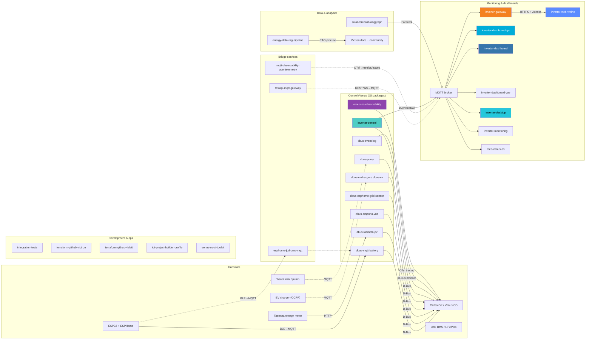

# System architecture (detailed)

Org-level map of how [victron-venus](https://github.com/victron-venus) repos connect around Cerbo GX / Venus OS.

For a skim-friendly version see the [organization profile README](../profile/README.md#system-architecture).
This page keeps the full repo-level graph (protocols and package names).

## Full stack

## How to read it

| Layer | What lives here |
|-------|-----------------|
| Hardware | Physical plant + Cerbo |
| Control | Venus OS packages on the GX (D-Bus services) |
| Bridge | Off-Cerbo bridges that feed MQTT / BMS |
| Monitoring & dashboards | MQTT consumers, gateway, UIs |
| Data & analytics | Forecast / RAG (optional) |
| Development & ops | CI, Terraform, org tooling |

Install path for a typical home stack: [INSTALL.md](./INSTALL.md).
