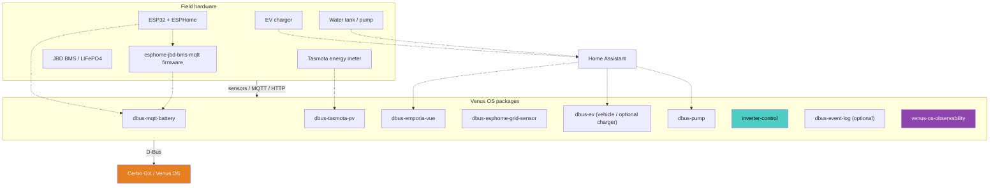
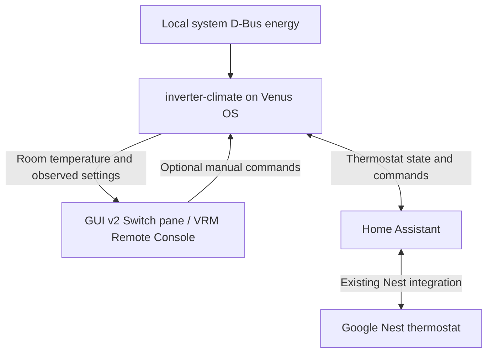
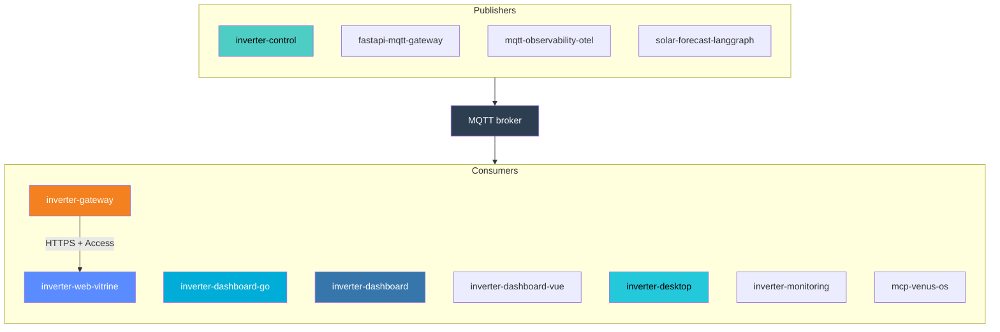
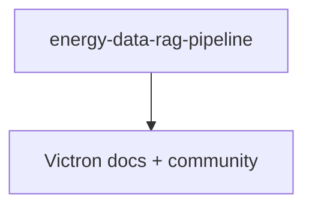

# System architecture (detailed)

Org-level map of how [victron-venus](https://github.com/victron-venus) repos connect around Cerbo GX / Venus OS.

Skim version: [organization profile README](../profile/README.md#system-architecture).

GitHub Mermaid scales **each** diagram to page width. One wide graph stays short and tiny — so this page uses several **narrow, top→bottom** diagrams instead.

## 1. Plant → Venus OS (on Cerbo)

```mermaid
flowchart TB
    subgraph Field["Field hardware"]
        direction TB
        ESP["ESP32 + ESPHome"]
        TAS["Tasmota energy meter"]
        EVCHG["EV charger"]
        PUMP["Water tank / pump"]
        BMS["JBD BMS / LiFePO4"]
        ESPH["esphome-jbd-bms-mqtt firmware"]
    end

    subgraph Pkgs["Venus OS packages"]
        direction TB
        BM["dbus-mqtt-battery"]
        PV["dbus-tasmota-pv"]
        EMP["dbus-emporia-vue"]
        GRD["dbus-esphome-grid-sensor"]
        EV["dbus-ev (vehicle / optional charger)"]
        PMP["dbus-pump"]
        IC["inverter-control"]
        EL["dbus-event-log (optional)"]
        OBS["venus-os-observability"]
    end

    Field -->|"sensors / MQTT / HTTP"| Pkgs
    Pkgs -->|"D-Bus"| CERBO["Cerbo GX / Venus OS"]

    ESP -.-> BM
    ESP -.-> ESPH
    ESPH -.-> BM
    TAS -.-> PV
    EVCHG -.-> HA["Home Assistant"]
    PUMP -.-> HA
    HA -.-> EV
    HA -.-> PMP
    HA -.-> EMP

    style CERBO fill:#e67e22,color:#fff
    style IC fill:#4ecdc4,color:#000
    style OBS fill:#8e44ad,color:#fff
```

Audited protocols: ESP/BMS → MQTT → `dbus-mqtt-battery`; Tasmota MQTT → `dbus-tasmota-pv`; Mercedes or Home Assistant → `dbus-ev`; Home Assistant → `dbus-pump` and `dbus-emporia-vue`. The optional integrated Mercedes charger belongs to `dbus-ev`; the standalone `dbus-evcharger` is archived. Follow the [EV migration guide](https://github.com/victron-venus/dbus-ev/blob/main/docs/mercedes-migration.md) before replacing an existing charger owner. These packages publish D-Bus values consumed by the controller and native Venus services. `venus-os-observability` reads D-Bus for metrics. This is a repository map: the optional event-log and ESPHome grid bridge were not installed on the audited GX, and the archived governance project does not mediate its controller writes.

### Thermostat integration on Venus OS

[inverter-climate](https://github.com/victron-venus/inverter-climate) runs as a
native supervised Python service on the GX or a Raspberry Pi with Venus OS.
It reads local system energy and publishes a room-temperature D-Bus device.
Home Assistant supplies thermostat state and the existing Google Nest integration.

```mermaid
flowchart TB
    ENERGY["Local system D-Bus energy"] --> CLIMATE["inverter-climate on Venus OS"]
    GUI["GUI v2 Switch pane / VRM Remote Console"] -->|"Optional manual commands"| CLIMATE
    CLIMATE -->|"Room temperature and observed settings"| GUI
    CLIMATE <-->|"Thermostat state and commands"| HA["Home Assistant"]
    HA <-->|"Existing Nest integration"| NEST["Google Nest thermostat"]
```

The temperature slider and Heat/Off selector use the stock Switchable Output API
on the same temperature service. Observation is the default. Manual control and
energy-aware automatic preheating are separate opt-ins; manual-only operation can
retain `mode = "observe"`. HA requests run outside the D-Bus loop and the separate
ESS controller. The native deployment needs no companion gateway or GUI patch,
while Nest still depends on HA and its cloud integration.

For a gas furnace, the configured electrical-load estimate describes its
electrical demand while heating. It is not a heat or gas measurement and is not
published as an additional AC load. See the
[installation guide](INSTALL.md#inverter-climate-home-assistant-thermostat-integration)
and the project's [D-Bus contract](https://github.com/victron-venus/inverter-climate/blob/main/docs/dbus-device.md).

## 2. MQTT → dashboards & edge

```mermaid
flowchart TB
    subgraph Pub["Publishers"]
        direction TB
        IC["inverter-control"]
        FG["fastapi-mqtt-gateway"]
        MO["mqtt-observability-otel"]
        SF["solar-forecast-langgraph"]
    end

    MQTT["MQTT broker"]

    subgraph Cons["Consumers"]
        direction TB
        IGW["inverter-gateway"]
        VIT["inverter-web-vitrine"]
        DGO["inverter-dashboard-go"]
        DPY["inverter-dashboard"]
        DVUE["inverter-dashboard-vue"]
        DT["inverter-desktop"]
        MON["inverter-monitoring"]
        MCP["mcp-venus-os"]
    end

    Pub --> MQTT --> Cons
    IGW -->|"HTTPS + Access"| VIT

    style MQTT fill:#2c3e50,color:#fff
    style IGW fill:#f48120,color:#fff
    style VIT fill:#5b8cff,color:#fff
    style DGO fill:#00ADD8,color:#fff
    style DPY fill:#3776ab,color:#fff
    style DT fill:#24c8db,color:#000
    style IC fill:#4ecdc4,color:#000
```

### Read-only voice and display reports

[inverter-gateway](https://github.com/victron-venus/inverter-gateway) owns the
`/v1/energy` source selection, units, freshness and report wording.
[amazon-echo-home-voice](https://github.com/4alvit/amazon-echo-home-voice) presents
those reports through an Alexa custom skill;
[google-home-voice-stats](https://github.com/4alvit/google-home-voice-stats)
presents them as Cast video and speech, with optional Home Assistant/Matter
voice triggers. These adapters run on a companion host and use scoped read-only
gateway access. Registering a voice entry point and testing a physical device
remain separate from installing source or a container.

## 3. Data & docs (optional)

```mermaid
flowchart TB
    RAG["energy-data-rag-pipeline"] --> DOCS["Victron docs + community"]
```

## Development & ops

No edges into the live energy path (table on purpose — a disconnected Mermaid subgraph blows out layout):

| Repo | Role |
|------|------|
| [integration-tests](https://github.com/victron-venus/integration-tests) | Cross-repo integration tests |
| [terraform-github-victron](https://github.com/4alvit/terraform-github-victron) | Org GitHub Terraform |
| [terraform-github-4alvit](https://github.com/4alvit/terraform-github-4alvit) | Personal GitHub Terraform |
| [iot-project-builder-profile](https://github.com/4alvit/iot-project-builder-profile) | Public IoT profile site |
| [venus-os-ci-toolkit](https://github.com/victron-venus/venus-os-ci-toolkit) | Shared CI workflows |

## How to read it

| Layer | What lives here |
|-------|-----------------|
| Hardware | Physical plant + Cerbo |
| Control | Venus OS packages on the GX (D-Bus) |
| Bridge | Off-Cerbo MQTT / BMS helpers |
| Monitoring & dashboards | MQTT consumers, gateway, UIs |
| Data & analytics | Forecast / RAG (optional) |
| Development & ops | CI, Terraform, org tooling |

Install path: [INSTALL.md](./INSTALL.md).
