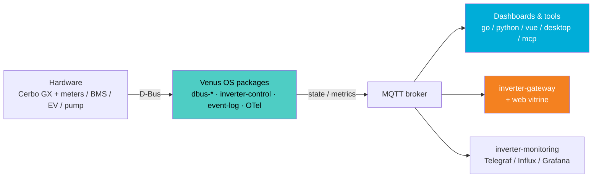

# Victron Venus

Open-source tools for **Victron Energy** systems on **Venus OS** — grid-zero control, battery/PV bridges, dashboards, and observability.

Created by [@4alvit](https://github.com/4alvit).

## Live demos

| Demo | What | Why |
|------|------|-----|
| [Inverter web vitrine](https://inverter.alvit.here.now/) | Live read-only PV / battery / grid status | Shows the public edge of this stack: browser → proxy → [`inverter-gateway`](https://github.com/victron-venus/inverter-gateway) behind Cloudflare Access — plant data on the web **without** opening the home network. Source: [`inverter-web-vitrine`](https://github.com/victron-venus/inverter-web-vitrine) |
| [IoT builder profile](https://4alvit.github.io/iot-project-builder-profile/) | Auto-scored profile over public IoT GitHub activity | Meta view of how this org (and related personal repos) read as a coherent engineering footprint — generated by [`iot-project-builder-profile`](https://github.com/4alvit/iot-project-builder-profile) |

## System architecture



[Detailed architecture →](../docs/architecture.md) (full repo graph and protocols).

> **ESP32 setup:** Flash [esphome-jbd-bms-mqtt](https://github.com/victron-venus/esphome-jbd-bms-mqtt) separately (not via Venus PackageManager). See [INSTALL.md](../docs/INSTALL.md).

## Repositories

### Core control & bridging

| Repository | Role |
|------------|------|
| [inverter-control](https://github.com/victron-venus/inverter-control) | Grid-zero ESS external control (4 s cadence, EV from D-Bus) |
| [dbus-mqtt-battery](https://github.com/victron-venus/dbus-mqtt-battery) | MQTT → D-Bus bridge for JBD BMS batteries (DVCC, reboot persistence) |
| [dbus-tasmota-pv](https://github.com/victron-venus/dbus-tasmota-pv) | Tasmota power meter → D-Bus PV inverter (daemontools multilog) |
| [dbus-emporia-vue](https://github.com/victron-venus/dbus-emporia-vue) | Emporia Vue submeters → D-Bus AC load (one per channel) |
| [dbus-esphome-grid-sensor](https://github.com/victron-venus/dbus-esphome-grid-sensor) | ESP32 CT sensor → D-Bus grid meter |
| [dbus-evcharger](https://github.com/victron-venus/dbus-evcharger) | EV charge point → D-Bus charger (OCPP via Cerbo MQTT) |
| [dbus-ev](https://github.com/victron-venus/dbus-ev) | EV charging session data → D-Bus |
| [dbus-pump](https://github.com/victron-venus/dbus-pump) | Water tank level / pump → D-Bus tank |
| [dbus-virtual-battery](https://github.com/victron-venus/dbus-virtual-battery) | Virtual battery for no-BMS chains |
| [dbus-event-log](https://github.com/victron-venus/dbus-event-log) | Audit log of D-Bus commands & state transitions |
| [dbus-service-template](https://github.com/4alvit/dbus-service-template) | Copier template for new D-Bus services (generation-test in CI) |
| [esphome-jbd-bms-mqtt](https://github.com/victron-venus/esphome-jbd-bms-mqtt) | ESP32 BLE proxy for JBD BMS → MQTT |
| [esphome-ble-sensor-patterns](https://github.com/4alvit/esphome-ble-sensor-patterns) | Production-ready ESPHome BLE sensor configurations |

### Dashboards & UI

| Repository | Role |
|------------|------|
| [inverter-dashboard-go](https://github.com/victron-venus/inverter-dashboard-go) | **Primary Cerbo dashboard** — single Go binary |
| [inverter-dashboard](https://github.com/victron-venus/inverter-dashboard) | Python/FastAPI dashboard — Docker `alvit/inverter-dashboard` |
| [inverter-dashboard-vue](https://github.com/victron-venus/inverter-dashboard-vue) | Shared Vue 3 SPA component library |
| [inverter-desktop](https://github.com/victron-venus/inverter-desktop) | Native Tauri desktop/mobile client |
| [inverter-web-vitrine](https://github.com/victron-venus/inverter-web-vitrine) | Public read-only status page ([live](https://inverter.alvit.here.now/)) |
| [inverter-monitoring](https://github.com/victron-venus/inverter-monitoring) | Telegraf + InfluxDB + Grafana stack |

### Platform services

| Repository | Role |
|------------|------|
| [inverter-gateway](https://github.com/victron-venus/inverter-gateway) | Remote HTTPS/SSE API over Cerbo MQTT (tunnel edge) |
| [terraform-cloudflare-inverter-gateway](https://github.com/victron-venus/terraform-cloudflare-inverter-gateway) | Cloudflare Zero Trust Access in front of inverter-gateway |
| [fastapi-mqtt-gateway](https://github.com/victron-venus/fastapi-mqtt-gateway) | REST/WebSocket → MQTT bridge (auth, rate limiting, streaming) |
| [mqtt-observability-opentelemetry](https://github.com/4alvit/mqtt-observability-opentelemetry) | OpenTelemetry observability for MQTT IoT systems |
| [venus-os-observability](https://github.com/victron-venus/venus-os-observability) | OTel/Prometheus for Venus OS — D-Bus tracing, metrics export (daemontools) |
| [venus-os-ci-toolkit](https://github.com/victron-venus/venus-os-ci-toolkit) | Reusable GitHub Actions workflows (lint, test, coverage, Scorecard) — pinned to commit SHA |
| [mcp-venus-os](https://github.com/victron-venus/mcp-venus-os) | MCP server for Venus OS D-Bus/MQTT management |

### Data & AI

| Repository | Role |
|------------|------|
| [energy-data-rag-pipeline](https://github.com/4alvit/energy-data-rag-pipeline) | RAG pipeline for Victron docs + community knowledge (FastAPI, LangChain, pgvector) |
| [solar-forecast-langgraph](https://github.com/4alvit/solar-forecast-langgraph) | Solar forecasting with LangGraph (OpenMeteo + historical data) |

### Testing & infrastructure

| Repository | Role |
|------------|------|
| [integration-tests](https://github.com/victron-venus/integration-tests) | MQTT / battery / PV integration test harness (reusable workflow) |
| [terraform-github-victron](https://github.com/victron-venus/terraform-github-victron) | Terraform for org repos, branch rules, and policies |
| [terraform-github-4alvit](https://github.com/4alvit/terraform-github-4alvit) | Terraform for 4alvit personal org |
| [iot-project-builder-profile](https://github.com/4alvit/iot-project-builder-profile) | Profile generator ([live Pages](https://4alvit.github.io/iot-project-builder-profile/)) — personal account |
| [.github](https://github.com/victron-venus/.github) | Organization profile and shared docs (this repo) |

### Dashboard choice

| Use case | Recommended repo |
|----------|------------------|
| Cerbo GX, minimal resources | **inverter-dashboard-go** |
| NAS / Docker / Portainer | **inverter-dashboard** (`alvit/inverter-dashboard`) |
| Desktop or mobile app | **inverter-desktop** |
| Long-term metrics & Grafana | **inverter-monitoring** |
| Custom Vue dashboard | **inverter-dashboard-vue** |
| Public web status (Zero Trust) | **inverter-web-vitrine** ([live](https://inverter.alvit.here.now/)) |

## Getting started

Full stack install guide: **[docs/INSTALL.md](../docs/INSTALL.md)**

Quick Cerbo bootstrap (Venus packages only):

```bash
git clone https://github.com/victron-venus/inverter-control.git  # or use bootstrap.sh from a local checkout
# See inverter-control README for SetupHelper / PackageManager install
```

## Community

- **Issues:** open in the relevant project repository
- **Discussions:** enable at org level (Settings → General → Discussions) or per-repo via Terraform `has_discussions = true`
- **Contributing:** [CONTRIBUTING.md](../CONTRIBUTING.md)

## License

Most projects use the MIT License. See each repository for details.

---

Community project — not affiliated with Victron Energy.