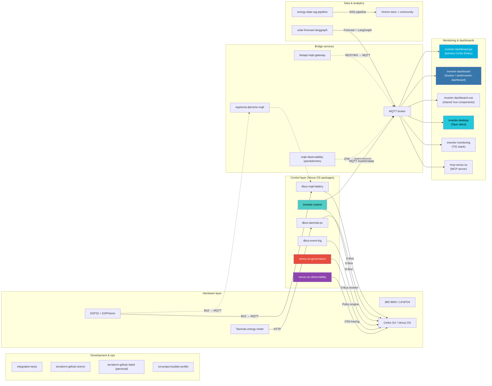

# Victron Venus

Open-source tools for **Victron Energy** systems on **Venus OS** — grid-zero control, battery/PV bridges, dashboards, and observability.

Created by [@4alvit](https://github.com/4alvit).

## System architecture



> **ESP32 setup:** Flash [esphome-jbd-bms-mqtt](https://github.com/victron-venus/esphome-jbd-bms-mqtt) separately (not via Venus PackageManager). See [INSTALL.md](../docs/INSTALL.md).

## Repositories

### Core control & bridging

| Repository | Role |
|------------|------|
| [inverter-control](https://github.com/victron-venus/inverter-control) | Grid-zero ESS external control (3 Hz loop, Home Assistant) |
| [dbus-mqtt-battery](https://github.com/victron-venus/dbus-mqtt-battery) | MQTT → D-Bus bridge for JBD BMS batteries (DVCC) |
| [dbus-tasmota-pv](https://github.com/victron-venus/dbus-tasmota-pv) | Tasmota power meter → D-Bus PV inverter |
| [dbus-event-log](https://github.com/victron-venus/dbus-event-log) | Audit log of D-Bus commands & state transitions |
| [dbus-service-template](https://github.com/victron-venus/dbus-service-template) | Copier template for new D-Bus services |
| [esphome-jbd-bms-mqtt](https://github.com/victron-venus/esphome-jbd-bms-mqtt) | ESP32 BLE proxy for JBD BMS → MQTT |
| [esphome-ble-sensor-patterns](https://github.com/victron-venus/esphome-ble-sensor-patterns) | Production-ready ESPHome BLE sensor configurations |

### Dashboards & UI

| Repository | Role |
|------------|------|
| [inverter-dashboard-go](https://github.com/victron-venus/inverter-dashboard-go) | **Primary Cerbo dashboard** — single Go binary |
| [inverter-dashboard](https://github.com/victron-venus/inverter-dashboard) | Python/FastAPI dashboard — Docker `alvit/inverter-dashboard` |
| [inverter-dashboard-vue](https://github.com/victron-venus/inverter-dashboard-vue) | Shared Vue 3 SPA component library |
| [inverter-desktop](https://github.com/victron-venus/inverter-desktop) | Native Tauri desktop/mobile client |
| [inverter-monitoring](https://github.com/victron-venus/inverter-monitoring) | Telegraf + InfluxDB + Grafana stack |

### Platform services

| Repository | Role |
|------------|------|
| [fastapi-mqtt-gateway](https://github.com/victron-venus/fastapi-mqtt-gateway) | REST/WebSocket → MQTT bridge (auth, rate limiting, streaming) |
| [mqtt-observability-opentelemetry](https://github.com/victron-venus/mqtt-observability-opentelemetry) | OpenTelemetry observability for MQTT IoT systems |
| [venus-os-observability](https://github.com/victron-venus/venus-os-observability) | OTel/Prometheus for Venus OS — D-Bus tracing, metrics export |
| [venus-os-governance](https://github.com/victron-venus/venus-os-governance) | Policy engine with approval gates — SOC limits, charge/discharge rules |
| [mcp-venus-os](https://github.com/victron-venus/mcp-venus-os) | MCP server for Venus OS D-Bus/MQTT management |

### Data & AI

| Repository | Role |
|------------|------|
| [energy-data-rag-pipeline](https://github.com/victron-venus/energy-data-rag-pipeline) | RAG pipeline for Victron docs + community knowledge (FastAPI, LangChain, pgvector) |
| [solar-forecast-langgraph](https://github.com/4alvit/solar-forecast-langgraph) | Solar forecasting with LangGraph (personal account) |
| [iot-project-builder-profile](https://github.com/victron-venus/iot-project-builder-profile) | Automated engineering profile generator from GitHub activity |

### Testing & infrastructure

| Repository | Role |
|------------|------|
| [integration-tests](https://github.com/victron-venus/integration-tests) | MQTT / battery / PV integration test harness |
| [terraform-github-victron](https://github.com/victron-venus/terraform-github-victron) | Terraform for org repos, branch rules, and policies |
| [.github](https://github.com/victron-venus/.github) | Organization profile and shared docs (this repo) |

### Dashboard choice

| Use case | Recommended repo |
|----------|------------------|
| Cerbo GX, minimal resources | **inverter-dashboard-go** |
| NAS / Docker / Portainer | **inverter-dashboard** (`alvit/inverter-dashboard`) |
| Desktop or mobile app | **inverter-desktop** |
| Long-term metrics & Grafana | **inverter-monitoring** |
| Custom Vue dashboard | **inverter-dashboard-vue** |

## Getting started

Full stack install guide: **[docs/INSTALL.md](../docs/INSTALL.md)**

Quick Cerbo bootstrap (Venus packages only):

```bash
git clone https://github.com/victron-venus/inverter-control.git  # or use bootstrap.sh from a local checkout
# See inverter-control README for SetupHelper / PackageManager install
```

## Community

- **Issues:** open in the relevant project repository
- **Discussions:** enable at org level (Settings → General → Discussions) or per-repo via Terraform `has_discussions = true`
- **Contributing:** [CONTRIBUTING.md](../CONTRIBUTING.md)

## License

Most projects use the MIT License. See each repository for details.

---

Community project — not affiliated with Victron Energy.