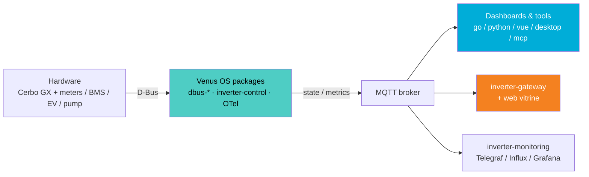

# Victron Venus

Open-source tools for **Victron Energy** systems on **Venus OS** — grid-zero control, thermostat integration, battery/PV bridges, dashboards, and observability.

Created by [@4alvit](https://github.com/4alvit).

## Live demos

| Demo | What | Why |
|------|------|-----|
| [Inverter web vitrine](https://inverter.alvit.here.now/) | Live read-only PV / battery / grid status | Shows the public edge of this stack: browser → proxy → [`inverter-gateway`](https://github.com/victron-venus/inverter-gateway) behind Cloudflare Access — plant data on the web **without** opening the home network. Source: [`inverter-web-vitrine`](https://github.com/victron-venus/inverter-web-vitrine) |
| [IoT builder profile](https://4alvit.github.io/iot-project-builder-profile/) | Auto-scored profile over public IoT GitHub activity | Meta view of how this org (and related personal repos) read as a coherent engineering footprint — generated by [`iot-project-builder-profile`](https://github.com/4alvit/iot-project-builder-profile) |

## System architecture


```mermaid
flowchart LR
    HW["Hardware\nCerbo GX + meters / BMS / EV / pump"]
    VENUS["Venus OS packages\ndbus-* · inverter-control · OTel"]
    MQTT["MQTT broker"]
    UI["Dashboards & tools\ngo / python / vue / desktop / mcp"]
    EDGE["inverter-gateway\n+ web vitrine"]
    MON["inverter-monitoring\nTelegraf / Influx / Grafana"]

    HW -->|"D-Bus"| VENUS
    VENUS -->|"state / metrics"| MQTT
    MQTT --> UI
    MQTT --> EDGE
    MQTT --> MON

    style VENUS fill:#4ecdc4,color:#000
    style EDGE fill:#f48120,color:#fff
    style UI fill:#00ADD8,color:#fff
```

[Detailed architecture →](https://github.com/victron-venus/.github/blob/main/docs/architecture.md) (full repo graph and protocols).

> **ESP32 setup:** Flash [esphome-jbd-bms-mqtt](https://github.com/victron-venus/esphome-jbd-bms-mqtt) separately (not via Venus PackageManager). See [INSTALL.md](https://github.com/victron-venus/.github/blob/main/docs/INSTALL.md).

## Repositories

Browse the [searchable public project catalog](https://victron-venus.github.io/.github/projects.html)
for deployment targets and related tools. Each repository owns its installation
requirements and release lifecycle; availability here does not imply a live deployment.

### Core control & bridging

| Repository | Role |
|------------|------|
| [inverter-control](https://github.com/victron-venus/inverter-control) | Grid-zero ESS external control (4 s cadence, EV from D-Bus) |
| [inverter-climate](https://github.com/victron-venus/inverter-climate) | Native Venus OS thermostat integration via Home Assistant, with room temperature, optional GUI v2 Heat/Off and setpoint controls, and energy-aware preheating |
| [dbus-mqtt-battery](https://github.com/victron-venus/dbus-mqtt-battery) | MQTT → D-Bus bridge for JBD BMS batteries (DVCC, reboot persistence) |
| [dbus-tasmota-pv](https://github.com/victron-venus/dbus-tasmota-pv) | Tasmota power meter → D-Bus PV inverter (daemontools multilog) |
| [dbus-emporia-vue](https://github.com/victron-venus/dbus-emporia-vue) | Emporia Vue submeters → D-Bus AC load (one per channel) |
| [dbus-esphome-grid-sensor](https://github.com/victron-venus/dbus-esphome-grid-sensor) | ESP32 CT sensor → D-Bus grid meter |
| [dbus-ev](https://github.com/victron-venus/dbus-ev) | Mercedes or Home Assistant vehicle telemetry → D-Bus; optional integrated Mercedes charger telemetry |
| [dbus-pump](https://github.com/victron-venus/dbus-pump) | Home Assistant water tank, pump and valve → native D-Bus services |
| [dbus-virtual-battery](https://github.com/victron-venus/dbus-virtual-battery) | Virtual battery for no-BMS chains |
| [dbus-event-log](https://github.com/victron-venus/dbus-event-log) | Optional audit log library/CLI; no validated native SetupHelper installer |
| [dbus-service-template](https://github.com/4alvit/dbus-service-template) | Template renderer for new D-Bus services (generation-test in CI) |
| [esphome-jbd-bms-mqtt](https://github.com/victron-venus/esphome-jbd-bms-mqtt) | ESP32 BLE proxy for JBD BMS → MQTT |
| [esphome-ble-sensor-patterns](https://github.com/4alvit/esphome-ble-sensor-patterns) | Production-ready ESPHome BLE sensor configurations |

**Thermostat control:** [inverter-climate](https://github.com/victron-venus/inverter-climate)
runs on the GX or a Raspberry Pi with Venus OS. It reads local D-Bus energy data
and uses the existing Home Assistant integration for Google Nest. Its optional
temperature slider and Heat/Off selector appear in the **GUI v2 Switch pane**, also
accessible through **VRM Remote Console**. Observation is the default; manual
control and automatic preheating are enabled separately. Install through
SetupHelper/PackageManager from the `latest` branch; see the
[native installation guide](https://github.com/victron-venus/inverter-climate/blob/main/deploy/venus/README.md).

### Dashboards & UI

| Repository | Role |
|------------|------|
| [inverter-dashboard-go](https://github.com/victron-venus/inverter-dashboard-go) | **Primary Cerbo dashboard** — single Go binary |
| [inverter-dashboard](https://github.com/victron-venus/inverter-dashboard) | Python/FastAPI dashboard — Docker `alvit/inverter-dashboard` |
| [inverter-dashboard-vue](https://github.com/victron-venus/inverter-dashboard-vue) | Shared Vue 3 SPA component library |
| [inverter-desktop](https://github.com/victron-venus/inverter-desktop) | Native Tauri desktop/mobile client |
| [inverter-web-vitrine](https://github.com/victron-venus/inverter-web-vitrine) | Public read-only status page ([live](https://inverter.alvit.here.now/)) |
| [inverter-monitoring](https://github.com/victron-venus/inverter-monitoring) | Telegraf + InfluxDB + Grafana stack |

### Platform services

| Repository | Role |
|------------|------|
| [inverter-gateway](https://github.com/victron-venus/inverter-gateway) | Remote HTTPS/SSE API over Cerbo MQTT (tunnel edge) |
| [terraform-cloudflare-inverter-gateway](https://github.com/victron-venus/terraform-cloudflare-inverter-gateway) | Cloudflare Zero Trust Access in front of inverter-gateway |
| [fastapi-mqtt-gateway](https://github.com/4alvit/fastapi-mqtt-gateway) | REST/WebSocket → MQTT bridge (auth, rate limiting, streaming) |
| [mqtt-observability-opentelemetry](https://github.com/4alvit/mqtt-observability-opentelemetry) | OpenTelemetry observability for MQTT IoT systems |
| [venus-os-observability](https://github.com/victron-venus/venus-os-observability) | OTel/Prometheus for Venus OS — D-Bus tracing, metrics export (daemontools) |
| [venus-os-ci-toolkit](https://github.com/victron-venus/venus-os-ci-toolkit) | Reusable GitHub Actions workflows (lint, test, coverage, Scorecard) — pinned to commit SHA |
| [mcp-venus-os](https://github.com/4alvit/mcp-venus-os) | Companion MCP server for Venus OS D-Bus/MQTT management |

### Data & AI

| Repository | Role |
|------------|------|
| [energy-data-rag-pipeline](https://github.com/4alvit/energy-data-rag-pipeline) | RAG pipeline for Victron docs + community knowledge (FastAPI, LangChain, pgvector) |
| [solar-forecast-langgraph](https://github.com/4alvit/solar-forecast-langgraph) | Solar forecasting with LangGraph (OpenMeteo + historical data) |

### Voice & displays

These read-only adapters consume the energy reports owned by
[inverter-gateway](https://github.com/victron-venus/inverter-gateway); they do not
calculate energy statistics or send inverter commands.

| Repository | Role |
|------------|------|
| [amazon-echo-home-voice](https://github.com/4alvit/amazon-echo-home-voice) | Alexa custom skill backend and screen cards; developer setup and physical device testing are separate steps |
| [google-home-voice-stats](https://github.com/4alvit/google-home-voice-stats) | Standalone Cast video/speech reports, with optional Home Assistant/Matter voice triggers |

### Testing & infrastructure

| Repository | Role |
|------------|------|
| [venus-os-integration-patterns](https://github.com/victron-venus/venus-os-integration-patterns) | Reference MQTT/D-Bus, HTTP and Home Assistant integration patterns |
| [integration-tests](https://github.com/victron-venus/integration-tests) | MQTT / battery / PV integration test harness (reusable workflow) |
| [terraform-github-victron](https://github.com/4alvit/terraform-github-victron) | Terraform for org repos, branch rules, and policies |
| [terraform-github-4alvit](https://github.com/4alvit/terraform-github-4alvit) | Terraform for the 4alvit personal account |
| [iot-project-builder-profile](https://github.com/4alvit/iot-project-builder-profile) | Profile generator ([live Pages](https://4alvit.github.io/iot-project-builder-profile/)) — personal account |
| [SetupHelper](https://github.com/victron-venus/SetupHelper) | Venus OS package setup and configuration helpers |
| [.github](https://github.com/victron-venus/.github) | Organization profile, project catalog and shared docs (this repo) |
| [victron-venus.github.io](https://github.com/victron-venus/victron-venus.github.io) | Root-domain redirect to the organization website |

### Archived projects

- [dbus-evcharger](https://github.com/victron-venus/dbus-evcharger) is retained for rollback. The maintained Mercedes vehicle/charger path lives in [dbus-ev](https://github.com/victron-venus/dbus-ev); follow its [migration guide](https://github.com/victron-venus/dbus-ev/blob/main/docs/mercedes-migration.md) and never run two owners of the same charger service.
- [venus-os-governance](https://github.com/victron-venus/venus-os-governance) is historical policy tooling. Current ESS checks belong to [inverter-control](https://github.com/victron-venus/inverter-control); the archived project is not an installed approval gate.

### Dashboard choice

| Use case | Recommended repo |
|----------|------------------|
| Cerbo GX, minimal resources | **inverter-dashboard-go** |
| NAS / Docker / Portainer | **inverter-dashboard** (`alvit/inverter-dashboard`) |
| Desktop or mobile app | **inverter-desktop** |
| Long-term metrics & Grafana | **inverter-monitoring** |
| Custom Vue dashboard | **inverter-dashboard-vue** |
| Public web status (Zero Trust) | **inverter-web-vitrine** ([live](https://inverter.alvit.here.now/)) |

## Getting started

Full stack install guide: **[docs/INSTALL.md](https://github.com/victron-venus/.github/blob/main/docs/INSTALL.md)**

Quick Cerbo bootstrap (Venus packages only):

```bash
git clone https://github.com/victron-venus/inverter-control.git
# See inverter-control README for SetupHelper / PackageManager install
```

## Community

- **Issues:** open in the relevant project repository
- **Discussions:** enable at org level (Settings → General → Discussions) or per-repo via Terraform `has_discussions = true`
- **Contributing:** [CONTRIBUTING.md](https://github.com/victron-venus/.github/blob/main/CONTRIBUTING.md)

## License

Most projects use the MIT License. See each repository for details.

---

Community project — not affiliated with Victron Energy.
